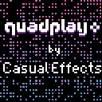

# Project Deployment Scratchpad

## Overview

This repo contains a number of prototypes in various stages of completion.

## Contents

||
|-----------------|
|project name: gridpusher.gridpusher.DEPLOY|
|this is where a description would be nice to generate somehow|
|[play gridpusher.gridpusher.DEPLOY](https://morgan3d.github.io/quadplay/console/quadplay.html?game=https://ssteinbach.github.io/quadplay_projects/gridpusher.gridpusher.DEPLOY/gridpusher.game.json)|

