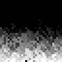

# Project Deployment Scratchpad

## Overview

This repo contains a number of prototypes in various stages of completion.

## Contents

### gridpusher
|label||||||
|-|-----|-----|-----|-----|-----|
|branch|gridpusher.main|gridpusher.float_music_mix_test|gridpusher.discrete_mix_test|main.discrete|gridpusher.floating_point_movement|
|description|main development branch for gridpusher|Floating point music mixing test - move aroudn the circles and hear stems fade in and out|discrete version of stem mixer|||
|Deployed on|03/31/2024|04/01/2024|04/01/2024|04/12/2024|04/13/2024|
|link|[play gridpusher.main](https://morgan3d.github.io/quadplay/console/quadplay.html?game=https://ssteinbach.github.io/quadplay_projects/gridpusher.gridpusher.main/gridpusher.game.json)|[play gridpusher.float_music_mix_test](https://morgan3d.github.io/quadplay/console/quadplay.html?game=https://ssteinbach.github.io/quadplay_projects/gridpusher.gridpusher.float_music_mix_test/gridpusher.game.json)|[play gridpusher.discrete_mix_test](https://morgan3d.github.io/quadplay/console/quadplay.html?game=https://ssteinbach.github.io/quadplay_projects/gridpusher.gridpusher.discrete_mix_test/gridpusher.game.json)|[play main.discrete](https://morgan3d.github.io/quadplay/console/quadplay.html?game=https://ssteinbach.github.io/quadplay_projects/gridpusher.main.discrete/gridpusher.game.json)|[play gridpusher.floating_point_movement](https://morgan3d.github.io/quadplay/console/quadplay.html?game=https://ssteinbach.github.io/quadplay_projects/gridpusher.gridpusher.floating_point_movement/gridpusher.game.json)|

### doom_fire
|label||
|-|-----|
|branch|doom_fire.main|
|description||
|Deployed on|04/16/2024|
|link|[play doom_fire.main](https://morgan3d.github.io/quadplay/console/quadplay.html?game=https://ssteinbach.github.io/quadplay_projects/doom_fire.doom_fire.main/doom_fire.game.json)|

