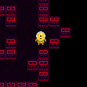
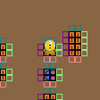
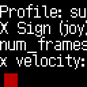
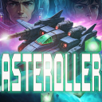
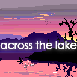
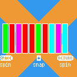
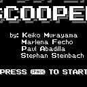

# Project Deployment Scratchpad

## Overview

This repo contains a number of prototypes in various stages of completion.

## Contents

### gridpusher

|label||||||||
|-|-----|-----|-----|-----|-----|-----|-----|
|branch|gridpusher.main.neon|gridpusher.float_music_mix_test|main.discrete|gridpusher.main|gridpusher.floating_point_movement|main.neon|gridpusher.discrete_mix_test|
|description||Floating point music mixing test  - move aroudn the circles and hear stems fade in and out|No description on branch.|main development branch for gridpusher|test of gridpusher prototype with 2d zelda style movement||discrete version of stem mixer|
|Deployed on|06/09/2025|04/26/2025|04/26/2025|04/26/2025|04/26/2025|04/26/2025|04/26/2025|
|link|[play gridpusher.main.neon](https://ssteinbach.github.io/quadplay_projects/gridpusher.gridpusher.main.neon)|[play gridpusher.float_music_mix_test](https://morgan3d.github.io/quadplay/console/quadplay.html?game=https://ssteinbach.github.io/quadplay_projects/gridpusher.gridpusher.float_music_mix_test/gridpusher.game.json)|[play main.discrete](https://morgan3d.github.io/quadplay/console/quadplay.html?game=https://ssteinbach.github.io/quadplay_projects/gridpusher.main.discrete/gridpusher.game.json)|[play gridpusher.main](https://morgan3d.github.io/quadplay/console/quadplay.html?game=https://ssteinbach.github.io/quadplay_projects/gridpusher.gridpusher.main/gridpusher.game.json)|[play gridpusher.floating_point_movement](https://ssteinbach.github.io/quadplay_projects/gridpusher.gridpusher.floating_point_movement)|[play main.neon](https://ssteinbach.github.io/quadplay_projects/gridpusher.main.neon)|[play gridpusher.discrete_mix_test](https://morgan3d.github.io/quadplay/console/quadplay.html?game=https://ssteinbach.github.io/quadplay_projects/gridpusher.gridpusher.discrete_mix_test/gridpusher.game.json)|

### dynamic_accel

|label||
|-|-----|
|branch|dynamic_accel.main|
|description|No description on branch.|
|Deployed on|04/26/2025|
|link|[play dynamic_accel.main](https://morgan3d.github.io/quadplay/console/quadplay.html?game=https://ssteinbach.github.io/quadplay_projects/dynamic_accel.dynamic_accel.main/dynamic_accel.game.json)|

### asteroller

|label||
|-|-----|
|branch|aurora|
|description||
|Deployed on|04/26/2025|
|link|[play aurora](https://morgan3d.github.io/quadplay/console/quadplay.html?game=https://ssteinbach.github.io/quadplay_projects/asteroller.aurora/asteroller.game.json)|

### dog_test

|label||
|-|-----|
|branch|dog_test.main|
|description|simple animated character test|
|Deployed on|04/26/2025|
|link|[play dog_test.main](https://morgan3d.github.io/quadplay/console/quadplay.html?game=https://ssteinbach.github.io/quadplay_projects/dog_test.dog_test.main/dog_test.game.json)|

### doom_fire

|label||
|-|-----|
|branch|doom_fire.main|
|description|Experiment using the doom fire algorithm|
|Deployed on|04/26/2025|
|link|[play doom_fire.main](https://morgan3d.github.io/quadplay/console/quadplay.html?game=https://ssteinbach.github.io/quadplay_projects/doom_fire.doom_fire.main/doom_fire.game.json)|

### snes_prototype

|label||
|-|-----|
|branch|snes_prototype.boxes|
|description|box throwing demo from the snes_prototype/super beat the wizzard|
|Deployed on|04/26/2025|
|link|[play snes_prototype.boxes](https://morgan3d.github.io/quadplay/console/quadplay.html?game=https://ssteinbach.github.io/quadplay_projects/snes_prototype.snes_prototype.boxes/snes_prototype.game.json)|

### across_the_lake

|label||
|-|-----|
|branch|across_the_lake|
|description||
|Deployed on||
|link|[play across_the_lake](https://ssteinbach.github.io/quadplay_projects/across_the_lake.across_the_lake)|

### snipsnap

|label||
|-|-----|
|branch|splitsnap.main|
|description|color matching action puzzle game|
|Deployed on|04/26/2025|
|link|[play splitsnap.main](https://morgan3d.github.io/quadplay/console/quadplay.html?game=https://ssteinbach.github.io/quadplay_projects/snipsnap.splitsnap.main/snipsnap.game.json)|

### scooper

|label||
|-|-----|
|branch|scooper.main|
|description|Jam 2 game about picking up dog poop|
|Deployed on|04/26/2025|
|link|[play scooper.main](https://morgan3d.github.io/quadplay/console/quadplay.html?game=https://ssteinbach.github.io/quadplay_projects/scooper.scooper.main/scooper.game.json)|

### reach

|label||
|-|-----|
|branch|reach.world_gen|
|description|No description on branch.|
|Deployed on|04/26/2025|
|link|[play reach.world_gen](https://morgan3d.github.io/quadplay/console/quadplay.html?game=https://ssteinbach.github.io/quadplay_projects/reach.reach.world_gen/reach.game.json)|

